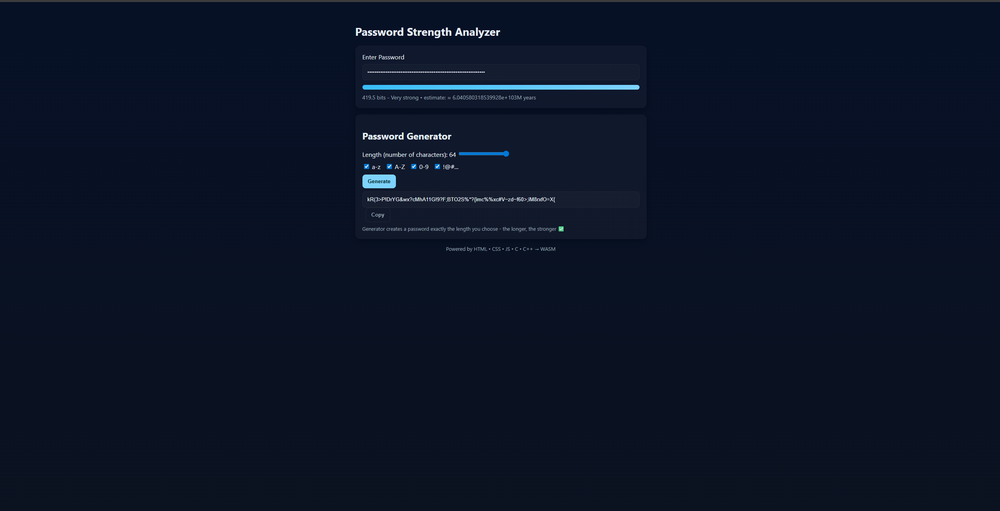

# 🔐 Password Strength Analyzer  

Password Strength Analyzer is a web-based tool that evaluates the security of user-entered passwords using **C, C++, JavaScript, HTML, and CSS**. It checks against a dictionary of common passwords, calculates entropy, and provides instant feedback with color-coded indicators for strength levels.

## ScreenShot

## ✨ Features  
- 🚫 Detects weak & common passwords (dictionary check in C++).  
- 📊 Entropy-based analysis (C module compiled to WebAssembly).  
- 🎨 Interactive UI with clear strength levels (red → green).  
- ⚡ Fast, secure, and entirely client-side (no data sent to server).  
- 🔗 Easy to run directly in any modern browser.  

## 🛠 Tech Stack  
- **Frontend**: HTML5, CSS3, JavaScript  
- **Backend Logic (compiled to WebAssembly)**: C & C++  
- **Interop**: WebAssembly + JS bridge  

## 📂 Project Structure  
PasswordStrengthAnalyzer/
├── index.html # Main UI page
├── styles.css # Styling for the analyzer
├── main.js # JS glue code & UI logic
├── dict.cpp # Dictionary-based password check (C++)
├── entropy.c # Entropy calculation (C)

## 🚀 Usage  
1. Open `index.html` in your browser.  
2. Enter a password in the input field.  
3. Instantly see strength score, entropy, and warnings.  

## 📌 Future Improvements  
- 🌍 Add localized password dictionaries.  
- 📉 Provide detailed feedback on how to improve weak passwords.  
- 🔒 Integrate optional breach-check (local safe DB).  

## 📜 License  
MIT License - Free to use, modify, and distribute.  